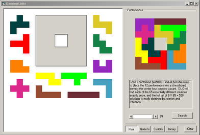



## Dancing Links

### Description

DLX is a depth-first-search backtracking algorithm that finds all solutions to the exact cover problem. Solve sudoku and N queens puzzles. See Knuth's Dancing Links paper for algorithm details.
 
### More Info
 

             |
---                |---
**Submitted On**   |2010-11-18 01:55:54
**By**             |[Korejwa2](https://github.com/Planet-Source-Code/PSCIndex/blob/master/ByAuthor/korejwa2.md)
**Level**          |Advanced
**User Rating**    |4.8 (24 globes from 5 users)
**Compatibility**  |VB 6\.0
**Category**       |[Data Structures](https://github.com/Planet-Source-Code/PSCIndex/blob/master/ByCategory/data-structures__1-33.md)
**World**          |[Visual Basic](https://github.com/Planet-Source-Code/PSCIndex/blob/master/ByWorld/visual-basic.md)
**Archive File**   |[Dancing\_Li21930811182010\.zip](https://github.com/Planet-Source-Code/korejwa2-dancing-links__1-73171/archive/master.zip)

